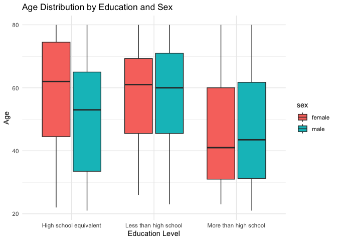
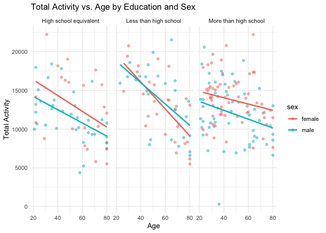
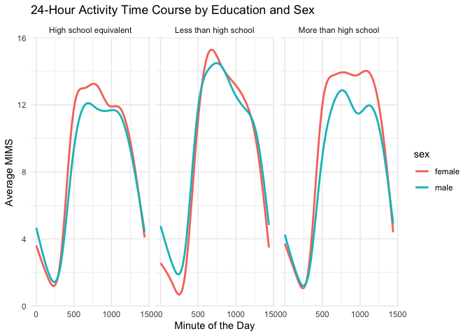

Homework 3
================
Mingyin Wang
2024-10-08

    ## ── Attaching core tidyverse packages ──────────────────────── tidyverse 2.0.0 ──
    ## ✔ dplyr     1.1.4     ✔ readr     2.1.5
    ## ✔ forcats   1.0.0     ✔ stringr   1.5.1
    ## ✔ ggplot2   3.5.1     ✔ tibble    3.2.1
    ## ✔ lubridate 1.9.3     ✔ tidyr     1.3.1
    ## ✔ purrr     1.0.2     
    ## ── Conflicts ────────────────────────────────────────── tidyverse_conflicts() ──
    ## ✖ dplyr::filter() masks stats::filter()
    ## ✖ dplyr::lag()    masks stats::lag()
    ## ℹ Use the conflicted package (<http://conflicted.r-lib.org/>) to force all conflicts to become errors

Problem 1

Problem 2 load clean, and tidy data

``` r
covar_df = read_csv("data/nhanes_covar.csv", skip = 4) |>
  janitor::clean_names() |>
  mutate(
      sex = recode(sex, "1" = "male", "2" = "female"),
      education = recode(education, "1" = "Less than high school", "2" = "High school equivalent", "3" = "More than high school"), 
    sex = factor(sex), 
    education = factor(education)
    )
```

    ## Rows: 250 Columns: 5
    ## ── Column specification ────────────────────────────────────────────────────────
    ## Delimiter: ","
    ## dbl (5): SEQN, sex, age, BMI, education
    ## 
    ## ℹ Use `spec()` to retrieve the full column specification for this data.
    ## ℹ Specify the column types or set `show_col_types = FALSE` to quiet this message.

``` r
clean_covar_df = covar_df |>
  filter(age >= 21) |>
  drop_na()

accel_df = read_csv("data/nhanes_accel.csv") |>
  janitor::clean_names() 
```

    ## Rows: 250 Columns: 1441
    ## ── Column specification ────────────────────────────────────────────────────────
    ## Delimiter: ","
    ## dbl (1441): SEQN, min1, min2, min3, min4, min5, min6, min7, min8, min9, min1...
    ## 
    ## ℹ Use `spec()` to retrieve the full column specification for this data.
    ## ℹ Specify the column types or set `show_col_types = FALSE` to quiet this message.

merge data frame

``` r
merged_df =  accel_df |>
  inner_join(clean_covar_df, by = "seqn")
```

create a readable table

``` r
education_sex_table = merged_df |>
  count(education, sex) |>
  spread(key = sex, value = n, fill = 0)
education_sex_table
```

    ## # A tibble: 3 × 3
    ##   education              female  male
    ##   <fct>                   <dbl> <dbl>
    ## 1 High school equivalent     23    35
    ## 2 Less than high school      28    27
    ## 3 More than high school      59    56

visualization of the age distributions for men and women in each
education category.

``` r
ggplot(merged_df, aes(x = education, y = age, fill = sex)) +
  geom_boxplot() + 
  labs(title = "Age Distribution by Education and Sex", x = "Education Level", y = "Age") +
  theme_minimal() 
```

<!-- -->

Create a total activity df

``` r
tot_act = 
  merged_df |>
  mutate(total_activity = rowSums(select(merged_df, starts_with("min"))))
```

Plot total activity vs. age, comparing men and women by education level

``` r
ggplot(tot_act, aes(x = age, y = total_activity, color = sex)) +
  geom_point(alpha = 0.5) +
  geom_smooth(method = "lm", se = FALSE) +
  facet_wrap(~education) +
  labs(title = "Total Activity vs. Age by Education and Sex", x = "Age", y = "Total Activity") +
  theme_minimal()
```

    ## `geom_smooth()` using formula = 'y ~ x'

<!-- -->

pivot longer the df

``` r
day_df = tot_act |>
  pivot_longer(cols= starts_with("min"),
               names_prefix = "min",
               names_to = "minute",
               values_to = "mims") |> 
  mutate(minute = as.numeric(minute)) 
```

Make a three-panel plot that shows the 24-hour activity time courses for
each education level

``` r
ggplot(day_df, aes(x = minute, y = mims, color = sex)) +
  geom_smooth(se = FALSE) +
  facet_wrap(~education) +
  labs(title = "24-Hour Activity Time Course by Education and Sex", x = "Minute of the Day", y = "Average MIMS") +
  theme_minimal()
```

    ## `geom_smooth()` using method = 'gam' and formula = 'y ~ s(x, bs = "cs")'

<!-- -->
