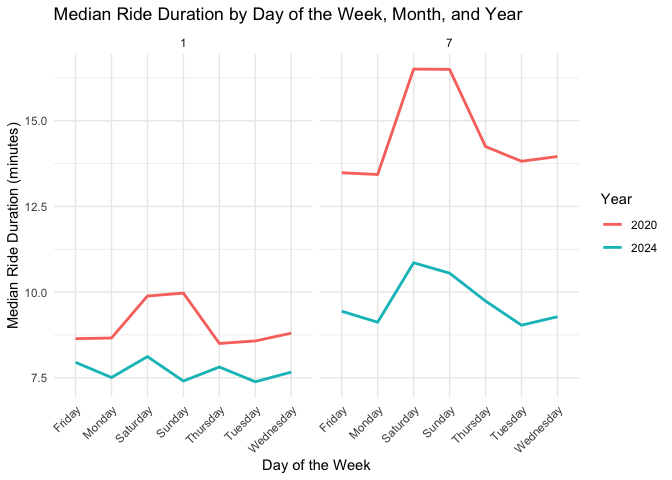
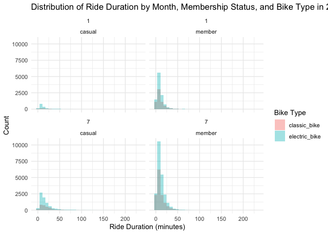

Homework 3
================
Mingyin Wang
2024-10-08

    ## ── Attaching core tidyverse packages ──────────────────────── tidyverse 2.0.0 ──
    ## ✔ dplyr     1.1.4     ✔ readr     2.1.5
    ## ✔ forcats   1.0.0     ✔ stringr   1.5.1
    ## ✔ ggplot2   3.5.1     ✔ tibble    3.2.1
    ## ✔ lubridate 1.9.3     ✔ tidyr     1.3.1
    ## ✔ purrr     1.0.2     
    ## ── Conflicts ────────────────────────────────────────── tidyverse_conflicts() ──
    ## ✖ dplyr::filter() masks stats::filter()
    ## ✖ dplyr::lag()    masks stats::lag()
    ## ℹ Use the conflicted package (<http://conflicted.r-lib.org/>) to force all conflicts to become errors

Problem 1

``` r
library(p8105.datasets)
data("ny_noaa")
```

Problem 2 load clean, and tidy data

``` r
covar_df = read_csv("data/nhanes_covar.csv", skip = 4) |>
  janitor::clean_names() |>
  mutate(
      sex = recode(sex, "1" = "male", "2" = "female"),
      education = recode(education, "1" = "Less than high school", "2" = "High school equivalent", "3" = "More than high school"), 
    sex = factor(sex), 
    education = factor(education)
    )
```

    ## Rows: 250 Columns: 5
    ## ── Column specification ────────────────────────────────────────────────────────
    ## Delimiter: ","
    ## dbl (5): SEQN, sex, age, BMI, education
    ## 
    ## ℹ Use `spec()` to retrieve the full column specification for this data.
    ## ℹ Specify the column types or set `show_col_types = FALSE` to quiet this message.

``` r
clean_covar_df = covar_df |>
  filter(age >= 21) |>
  drop_na()

accel_df = read_csv("data/nhanes_accel.csv") |>
  janitor::clean_names() 
```

    ## Rows: 250 Columns: 1441
    ## ── Column specification ────────────────────────────────────────────────────────
    ## Delimiter: ","
    ## dbl (1441): SEQN, min1, min2, min3, min4, min5, min6, min7, min8, min9, min1...
    ## 
    ## ℹ Use `spec()` to retrieve the full column specification for this data.
    ## ℹ Specify the column types or set `show_col_types = FALSE` to quiet this message.

merge data frame

``` r
merged_df =  accel_df |>
  inner_join(clean_covar_df, by = "seqn")
```

create a readable table

``` r
education_sex_table = merged_df |>
  count(education, sex) |>
  spread(key = sex, value = n, fill = 0)
education_sex_table
```

    ## # A tibble: 3 × 3
    ##   education              female  male
    ##   <fct>                   <dbl> <dbl>
    ## 1 High school equivalent     23    35
    ## 2 Less than high school      28    27
    ## 3 More than high school      59    56

visualization of the age distributions for men and women in each
education category.

``` r
ggplot(merged_df, aes(x = education, y = age, fill = sex)) +
  geom_boxplot() + 
  labs(title = "Age Distribution by Education and Sex", x = "Education Level", y = "Age") +
  theme_minimal() 
```

<!-- -->

Create a total activity df

``` r
tot_act = 
  merged_df |>
  mutate(total_activity = rowSums(select(merged_df, starts_with("min"))))
```

Plot total activity vs. age, comparing men and women by education level

``` r
ggplot(tot_act, aes(x = age, y = total_activity, color = sex)) +
  geom_point(alpha = 0.5) +
  geom_smooth(method = "lm", se = FALSE) +
  facet_wrap(~education) +
  labs(title = "Total Activity vs. Age by Education and Sex", x = "Age", y = "Total Activity") +
  theme_minimal()
```

    ## `geom_smooth()` using formula = 'y ~ x'

<!-- -->

pivot longer the df

``` r
day_df = tot_act |>
  pivot_longer(cols= starts_with("min"),
               names_prefix = "min",
               names_to = "minute",
               values_to = "mims") |> 
  mutate(minute = as.numeric(minute)) 
```

Make a three-panel plot that shows the 24-hour activity time courses for
each education level

``` r
ggplot(day_df, aes(x = minute, y = mims, color = sex)) +
  geom_smooth(se = FALSE) +
  facet_wrap(~education) +
  labs(title = "24-Hour Activity Time Course by Education and Sex", x = "Minute of the Day", y = "Average MIMS") +
  theme_minimal()
```

    ## `geom_smooth()` using method = 'gam' and formula = 'y ~ s(x, bs = "cs")'

<!-- -->

Question 3

laod the datasets

``` r
jan_2020 = read_csv("data/citibike/Jan 2020 Citi.csv") |>
  janitor::clean_names() |>
  mutate(year = 2020, month = 1)
```

    ## Rows: 12420 Columns: 7
    ## ── Column specification ────────────────────────────────────────────────────────
    ## Delimiter: ","
    ## chr (6): ride_id, rideable_type, weekdays, start_station_name, end_station_n...
    ## dbl (1): duration
    ## 
    ## ℹ Use `spec()` to retrieve the full column specification for this data.
    ## ℹ Specify the column types or set `show_col_types = FALSE` to quiet this message.

``` r
jan_2024 = read_csv("data/citibike/Jan 2024 Citi.csv") |>
   janitor::clean_names() |>
  mutate(year = 2024, month = 1)
```

    ## Rows: 18861 Columns: 7
    ## ── Column specification ────────────────────────────────────────────────────────
    ## Delimiter: ","
    ## chr (6): ride_id, rideable_type, weekdays, start_station_name, end_station_n...
    ## dbl (1): duration
    ## 
    ## ℹ Use `spec()` to retrieve the full column specification for this data.
    ## ℹ Specify the column types or set `show_col_types = FALSE` to quiet this message.

``` r
july_2020 = read_csv("data/citibike/July 2020 Citi.csv") |>
   janitor::clean_names() |>
  mutate(year = 2020, month = 7)
```

    ## Rows: 21048 Columns: 7
    ## ── Column specification ────────────────────────────────────────────────────────
    ## Delimiter: ","
    ## chr (6): ride_id, rideable_type, weekdays, start_station_name, end_station_n...
    ## dbl (1): duration
    ## 
    ## ℹ Use `spec()` to retrieve the full column specification for this data.
    ## ℹ Specify the column types or set `show_col_types = FALSE` to quiet this message.

``` r
july_2024 = read_csv("data/citibike/July 2024 Citi.csv") |>
   janitor::clean_names() |>
 mutate(year = 2024, month = 7)
```

    ## Rows: 47156 Columns: 7
    ## ── Column specification ────────────────────────────────────────────────────────
    ## Delimiter: ","
    ## chr (6): ride_id, rideable_type, weekdays, start_station_name, end_station_n...
    ## dbl (1): duration
    ## 
    ## ℹ Use `spec()` to retrieve the full column specification for this data.
    ## ℹ Specify the column types or set `show_col_types = FALSE` to quiet this message.

combine all data

``` r
combined_df = bind_rows(jan_2020, jan_2024, july_2020, july_2024)
combined_df
```

    ## # A tibble: 99,485 × 9
    ##    ride_id   rideable_type weekdays duration start_station_name end_station_name
    ##    <chr>     <chr>         <chr>       <dbl> <chr>              <chr>           
    ##  1 4BE06CB3… classic_bike  Tuesday     15.3  Columbus Ave & W … E 53 St & Madis…
    ##  2 26886E03… classic_bike  Wednesd…     5.31 2 Ave & E 96 St    1 Ave & E 110 St
    ##  3 24DC5606… classic_bike  Friday       9.69 Columbia St & Riv… Grand St & Eliz…
    ##  4 EEDC1053… classic_bike  Sunday       7.00 W 84 St & Columbu… Columbus Ave & …
    ##  5 2CD4BD4C… classic_bike  Friday       2.85 Forsyth St & Broo… Suffolk St & St…
    ##  6 E18682F9… classic_bike  Sunday      25.5  Allen St & Hester… Atlantic Ave & …
    ##  7 B9B2E896… classic_bike  Sunday       3.65 Lafayette St & Je… Washington Pl &…
    ##  8 DEF8F504… classic_bike  Sunday      38.3  28 Ave & 44 St     Broadway & Kosc…
    ##  9 17D44DA9… classic_bike  Thursday    38.5  Barrow St & Hudso… Emerson Pl & My…
    ## 10 0FD113A3… classic_bike  Tuesday      6.52 Carlton Ave & Par… Emerson Pl & My…
    ## # ℹ 99,475 more rows
    ## # ℹ 3 more variables: member_casual <chr>, year <dbl>, month <dbl>

Produce a reader-friendly table showing the total number of rides in
each combination of year and month separating casual riders and Citi
Bike members.

``` r
rides_summary = combined_df |>
  group_by(year, month, member_casual) |>
  summarize(total_rides = n(), .groups = 'drop') |>
  pivot_wider(names_from = member_casual, values_from = total_rides) |>
  mutate(total_rides_month = rowSums(across(c(casual, member), ~replace_na(., 0))))
rides_summary
```

    ## # A tibble: 4 × 5
    ##    year month casual member total_rides_month
    ##   <dbl> <dbl>  <int>  <int>             <dbl>
    ## 1  2020     1    984  11436             12420
    ## 2  2020     7   5637  15411             21048
    ## 3  2024     1   2108  16753             18861
    ## 4  2024     7  10894  36262             47156

Make a table showing the 5 most popular starting stations for July 2024;
include the number of rides originating from these stations.

``` r
five_popular_stations = combined_df |>
  filter(year == 2024, month == 7) |>
  group_by(start_station_name) |>
  summarize(n_rides = n()) |>
  arrange(desc(n_rides)) |>
  head(5)
five_popular_stations
```

    ## # A tibble: 5 × 2
    ##   start_station_name       n_rides
    ##   <chr>                      <int>
    ## 1 Pier 61 at Chelsea Piers     163
    ## 2 University Pl & E 14 St      155
    ## 3 W 21 St & 6 Ave              152
    ## 4 West St & Chambers St        150
    ## 5 W 31 St & 7 Ave              146

Make a plot to investigate the effects of day of the week, month, and
year on median ride duration.

``` r
median_ride_duration = 
  combined_df |>
  group_by(year, month, weekdays) |>
  summarize(median_duration = median(duration, na.rm = TRUE), .groups = "drop")


ggplot(median_ride_duration, aes(x = weekdays, y = median_duration, color = factor(year))) +
  geom_line(aes(group = interaction(year, month)), size = 1) +  
  facet_wrap(~ month) +  
  labs(
    title = "Median Ride Duration by Day of the Week, Month, and Year",
    x = "Day of the Week",
    y = "Median Ride Duration (minutes)",
    color = "Year"
  ) +
  theme_minimal() +
  theme(axis.text.x = element_text(angle = 45, hjust = 1))
```

    ## Warning: Using `size` aesthetic for lines was deprecated in ggplot2 3.4.0.
    ## ℹ Please use `linewidth` instead.
    ## This warning is displayed once every 8 hours.
    ## Call `lifecycle::last_lifecycle_warnings()` to see where this warning was
    ## generated.

<!-- -->

For data in 2024, make a figure that shows the impact of month,
membership status, and bike type on the distribution of ride duration.

``` r
df_2024 =
  combined_df |> 
  filter(year == 2024) 

ggplot(df_2024, aes(x = duration, fill = rideable_type)) +
  geom_histogram(binwidth = 7, alpha = .4, position = "identity") +   
  facet_wrap(~ month + member_casual) +
  labs(title = "Distribution of Ride Duration by Month, Membership Status, and Bike Type in 2024",
       x = "Ride Duration (minutes)",
       y = "Count",
       fill = "Bike Type") +
  theme_minimal() 
```

<!-- -->
